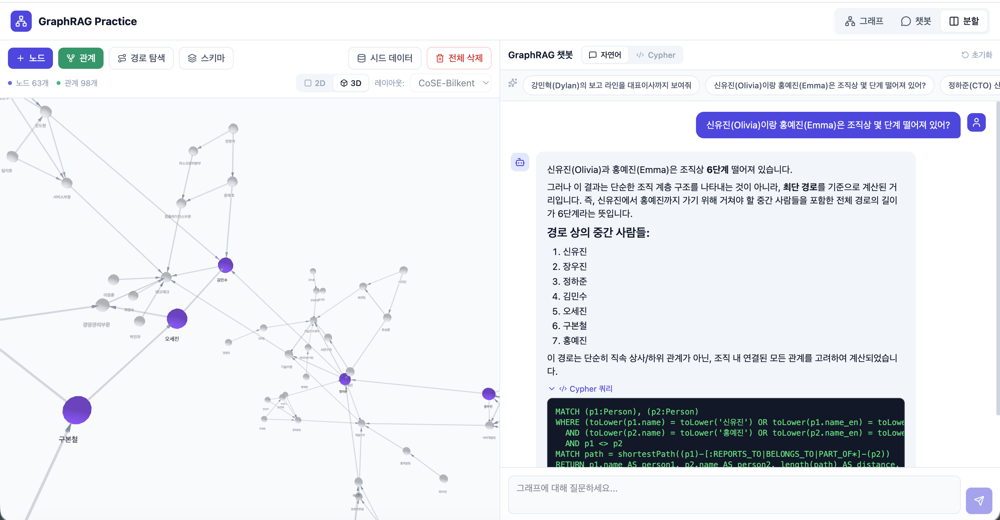
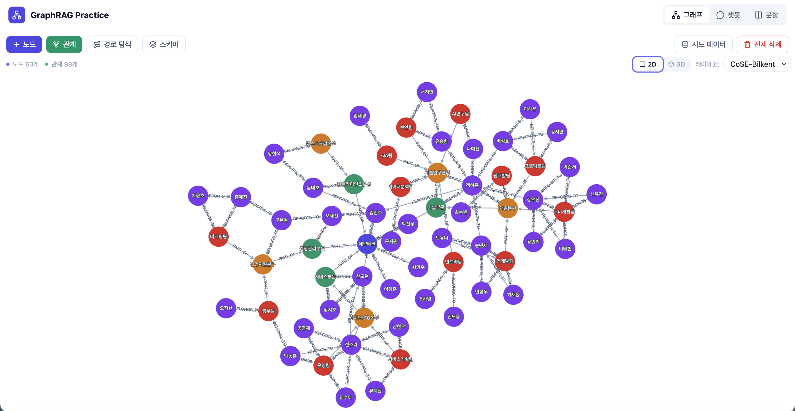
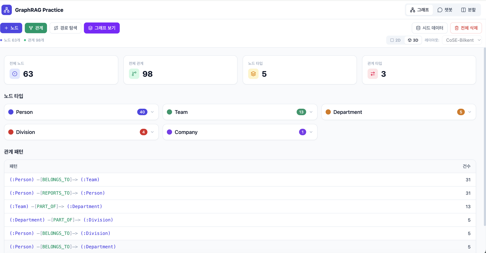
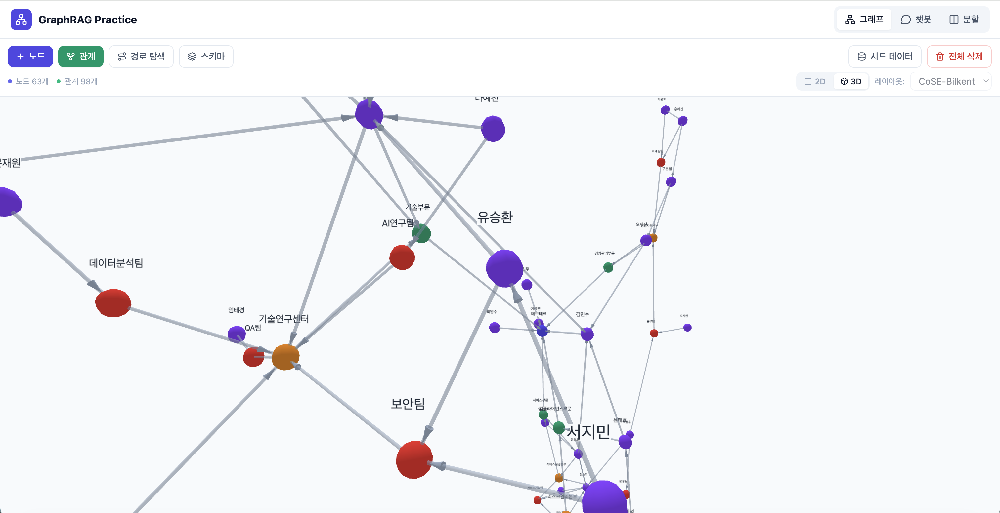
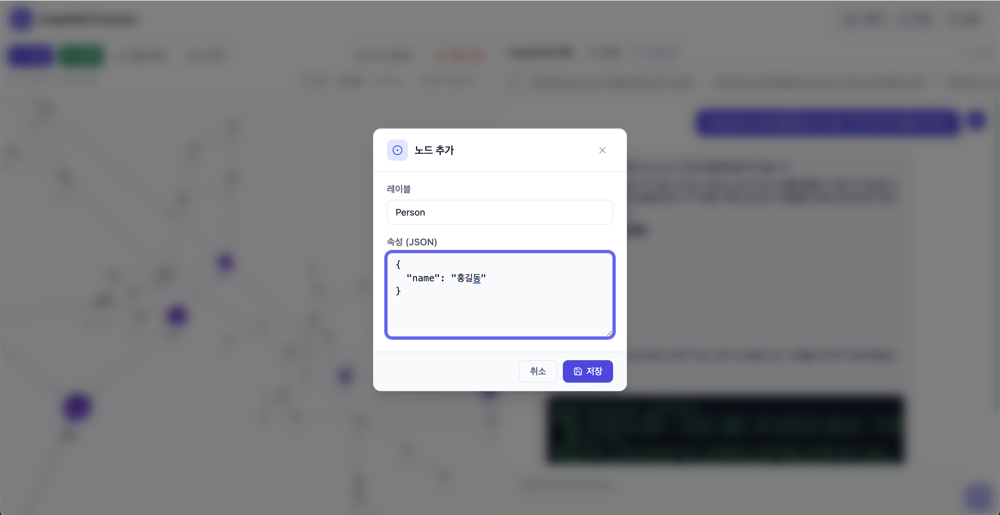

# Text2Cypher

자연어를 Cypher 쿼리로 변환하고 Neo4j 그래프를 시각화하는 GraphRAG 플레이그라운드입니다.

LLM이 자연어 질문에서 Cypher를 생성하고, Neo4j에서 실행한 결과를 다시 자연어로 요약합니다. 그래프는 2D(Cytoscape.js) / 3D(force-graph) 뷰로 탐색할 수 있습니다.

```
React ── HTTP ──► FastAPI ── Bolt ──► Neo4j
                     │
                     ▼
                LLM Provider
              (Ollama / Bedrock)
```

## Tech Stack

| Layer | Tech |
|-------|------|
| Frontend | React 19, TypeScript, Cytoscape.js, react-force-graph-3d, Tailwind CSS 4 |
| Backend | FastAPI, Pydantic |
| Database | Neo4j 5 Community |
| LLM | Ollama (local) / AWS Bedrock (cloud) |
| Infra | Docker Compose, Vite 7, uv |

## Quick Start

```bash
# 환경 변수
cp .env.example .env

# Ollama 모델 다운로드 (아무 모델이나 사용 가능)
ollama pull <model-name>

# 전체 스택 실행
docker compose up -d

# 시드 데이터 삽입
docker compose exec backend uv run seed.py
```

실행 후 http://localhost:3000 으로 접속합니다.

| Service | URL |
|---------|-----|
| Frontend | http://localhost:3000 |
| Backend API | http://localhost:8000/docs |
| Neo4j Browser | http://localhost:7474 |

## LLM Provider

`.env`의 `LLM_PROVIDER`로 전환합니다.

### Ollama (기본값)

```env
LLM_PROVIDER=ollama
OLLAMA_BASE_URL=http://localhost:11434
OLLAMA_MODEL=<model-name>
```

### AWS Bedrock

```env
LLM_PROVIDER=bedrock
AWS_REGION=ap-northeast-2
BEDROCK_MODEL_ID=anthropic.claude-sonnet-4-20250514-v1:0
```

AWS CLI 인증(`aws configure`)이 선행되어야 합니다.

## Development (without Docker)

```bash
# Neo4j만 Docker로
docker compose up neo4j -d

# Backend
cd backend && uv sync
uv run uvicorn app.main:app --reload --port 8000
uv run seed.py

# Frontend
cd frontend && npm install
npm run dev  # localhost:5173
```

## Features

- 자연어 → Cypher 자동 변환 및 실행 (한국어/영어)
- Cypher 직접 실행 모드
- 2D / 3D 그래프 시각화 (레이아웃 전환)
- 노드/관계 CRUD
- 최단 경로 탐색
- 스키마 탐색
- 쿼리 결과 노드 하이라이트
- Split View (그래프 + 챗봇)

## Screenshots

| Split View (그래프 + 챗봇) | 그래프 시각화 (2D) |
|:---:|:---:|
|  |  |

| 스키마 탐색 | 그래프 시각화 (확대) |
|:---:|:---:|
|  |  |

| 노드 추가 다이얼로그 |
|:---:|
|  |

## License

MIT